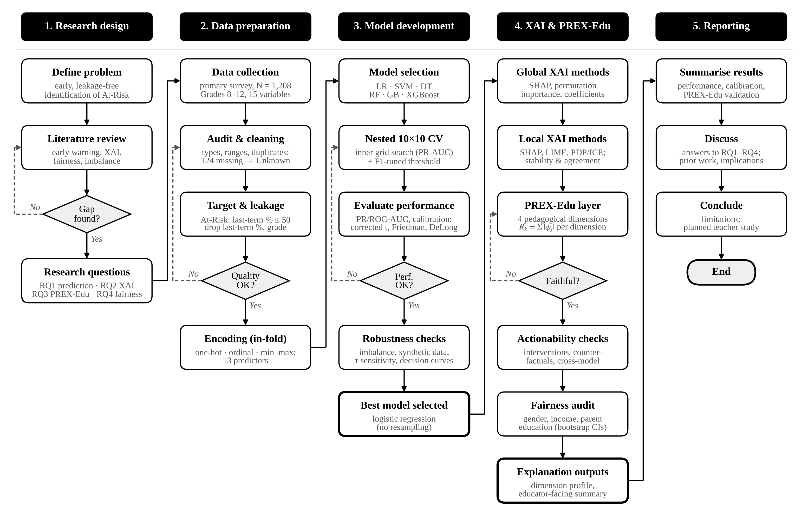
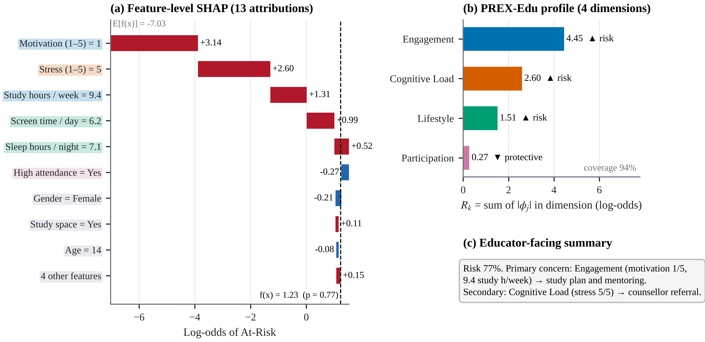
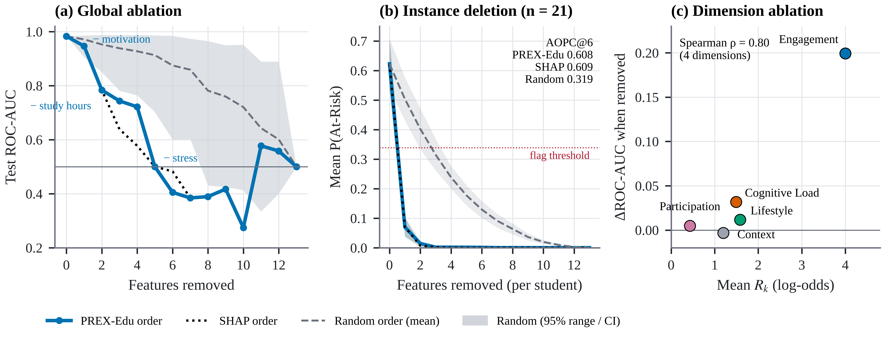

<div align="center">

# PREX-Edu

### From Feature Attributions to Pedagogical Levers in the Early Identification of At-Risk Secondary-School Students

[](https://doi.org/10.5281/zenodo.23185848)
[](LICENSE)
[](data/synthetic/DATASHEET.md)
[](requirements.txt)

**Imaad Hajwane** · **Jayshree Ghorpade-Aher**
Department of Computer Engineering & Technology, Dr. Vishwanath Karad MIT World Peace University, Pune, India

*Code, results and synthetic data accompanying a manuscript submitted to the* Journal of Educational Data Mining.

</div>

---

## Overview

Early-warning models help schools only if teachers can act on them. Feature-level explanations such as SHAP list many overlapping variables, while teachers think in terms of engagement, routines, wellbeing and attendance.

**PREX-Edu** groups SHAP attributions into four theory-based, actionable dimensions and keeps socio-demographic variables in a separate, non-actionable context block:

| Dimension | Features | Typical school action |
|---|---|---|
| **Engagement** | weekly study hours, motivation | study plan, mentoring |
| **Lifestyle** | sleep, screen time | sleep and screen-time counselling with the family |
| **Cognitive Load** | stress | counsellor referral, workload review |
| **Participation** | high attendance | attendance follow-up with parents |
| *Context* (not acted on) | age, gender, parental education, income, study space, extracurricular, difficult subject | — |

For student **x** and dimension *k*, the score is $R_k(\mathbf{x}) = \sum_{j \in D_k} |\phi_j(\mathbf{x})|$, where $\phi_j$ are SHAP values. The repository then tests whether these grouped explanations are **faithful** to the model and **actionable** for students.

<p align="center">
  
</p>

## Key results

Primary dataset: 1,208 secondary-school students (Grades 8–12), 66 At-Risk (5.5%), 13 predictors that exclude prior attainment.

| Question | Result |
|---|---|
| **Prediction** (nested 10×10 CV) | Logistic regression ranked first: ROC-AUC **0.966 ± 0.018**, PR-AUC **0.713 ± 0.129**, calibration slope 0.91. It was not significantly worse than any of five alternatives. |
| **Faithfulness** | Removing the top-ranked Engagement dimension lowered ROC-AUC by **0.199**, against 0.026 for random removal (permutation *p* = .030). |
| **Aggregation operator** | Summing absolute SHAP values matched the exact group-Shapley ranking for **100%** of flagged students; averaging matched 71%. |
| **Actionability** | Improving the top-ranked dimension gave the largest simulated risk reduction for **81–100%** of flagged students; counterfactuals targeted it in **95%**. |
| **Fairness** | No significant gender gap; low-income students were flagged more often, in line with their higher base rate. |
| **Robustness** | Resampling harmed calibration (ECE ×8–15) without improving ranking; synthetic augmentation did not improve prediction. |

<p align="center">
  
  <br><em>The same prediction explained at feature level (left) and by PREX-Edu (right).</em>
</p>

<p align="center">
  
  <br><em>Faithfulness: global ablation, per-student deletion and single-dimension ablation.</em>
</p>

## Repository structure

```
XAI-in-Education/
├── src/prexedu/          core package
│   ├── config.py         all settings: paths, seed, folds, grids, τ, PREX-Edu dimensions
│   ├── data.py           loading, cleaning, encoding
│   ├── models.py         classifiers and imbalance strategies
│   ├── cv.py             nested repeated cross-validation
│   ├── evaluation.py     metrics, DeLong, corrected t-test, calibration, decision curves
│   ├── xai.py            SHAP, LIME, PDP/ICE, ablation helpers
│   ├── prex.py           PREX-Edu aggregation and explanation text
│   ├── plotting.py       shared figure style
│   └── tables.py         CSV / LaTeX / Markdown table export
├── scripts/              numbered analysis steps (00–17)
├── run_all.py            runs the steps in order
├── outputs/
│   ├── tables/           every result table (CSV, LaTeX, Markdown) + PREX-Edu_all_tables.xlsx
│   └── figures/          every figure (vector PDF + 600-dpi PNG)
└── data/
    └── synthetic/        open synthetic replica + datasheet
```

## Installation

Requires Python 3.10 or later.

```bash
git clone https://github.com/Imaadhajwane/XAI-in-Education.git
cd XAI-in-Education
python -m venv .venv
source .venv/bin/activate          # Windows: .venv\Scripts\activate
pip install -r requirements.txt    # exact versions: requirements-lock.txt
```

## Usage

### With the synthetic data (open)

```bash
# macOS / Linux
export PREX_DATA=data/synthetic/PREX-Edu_SYNTHETIC_n5000.csv
# Windows PowerShell
$env:PREX_DATA = "data/synthetic/PREX-Edu_SYNTHETIC_n5000.csv"

python run_all.py --fast --skip 00 12 16 17 99
```

`--fast` uses reduced settings for a quick check (about 15 minutes). Steps 00, 16 and 17 need the continuous last-term percentage, which the synthetic file does not contain, and step 12 refits the synthetic generators. Numbers from synthetic data must not be reported as results.

### With the original data (on request)

Place the survey file at `data/raw/student_performance_dataset.xlsx`, then:

```bash
python run_all.py                    # full pipeline, about 1.5–3 h on a 4-core laptop
python run_all.py --only 10 13       # selected steps
python scripts/17_paper_figures.py   # redraw the manuscript figures from saved results
```

All outputs are written to `outputs/`. Every setting is in `src/prexedu/config.py` (seed 42).

## Reproducing the manuscript

| Manuscript | Script | Output files |
|---|---|---|
| Figure 1 · methodology | `08b_methodology_flowchart.py` | `FigM_methodology_flowchart` |
| Figures 2–3, 5–12 | `17_paper_figures.py` | `PF02`–`PF11` |
| Table 1 · descriptives | `00_data_audit_eda.py` | `S01`, `S02` |
| Table 3, Figure 4 · nested CV, Friedman–Nemenyi | `10_nested_repeated_cv.py` | `P01`–`P07` |
| Table 4 · global importance | `02_xai_shap_lime_pdp.py` | `S06`, `T10`, `T11` |
| Table 5 · faithfulness | `03_prexedu_framework.py` | `T12`, `S07`–`S09` |
| Table 6 · cross-model consistency, operator choice | `15_aggregation_crossmodel.py` | `S24`, `S25` |
| Intervention simulation, counterfactuals | `05_intervention_counterfactuals.py` | `S11`, `S13` |
| Fairness audit | `14_fairness_extended.py` | `S22`, `S23` |
| Table 7 · class-imbalance strategies | `11_imbalance_strategies.py` | `S05` |
| Synthetic data: fidelity, privacy, augmentation | `12_synthetic_augmentation.py` | `S18`, `S19` |
| Tables 8–10 · grids, pairwise tests, calibration | `10_nested_repeated_cv.py`, `13_calibration_threshold_dca.py` | `P03`, `P05`, `P07`, `S20`, `S21` |
| Table 11 · hold-out evaluation | `01_model_comparison_holdout.py` | `T06`–`T09` |
| Table 12 · outcome-threshold sensitivity | `16_target_sensitivity.py` | `S26` |
| Tables 13–14 · planned teacher study | `06_educator_study.py` | `A09`, `S16` |

## Data and ethics

The original survey responses come from secondary-school students and are **not distributed**. They are available from the authors on reasonable request. The study did not undergo review by an institutional ethics committee. Participation was voluntary and anonymous, and no identifying information was collected.

To support reproducibility without exposing any student, `data/synthetic/` provides 5,000 records from a class-conditional Gaussian copula fitted to the training data. It contains no exact copies of real students and passed a distance-to-closest-record privacy check (see the [datasheet](data/synthetic/DATASHEET.md)). Result tables containing one row per real student are deliberately excluded from this repository.

## Citation

If you use this code or the synthetic data, please cite:

```bibtex
@software{hajwane2026prexedu,
  author    = {Hajwane, Imaad and Ghorpade-Aher, Jayshree},
  title     = {{PREX-Edu}: From Feature Attributions to Pedagogical Levers in the
               Early Identification of At-Risk Secondary-School Students
               (code and synthetic data)},
  year      = {2026},
  publisher = {Zenodo},
  version   = {1.0.0},
  doi       = {10.5281/zenodo.23185848},
  url       = {https://doi.org/10.5281/zenodo.23185848}
}
```

GitHub's **Cite this repository** button provides the same reference from [`CITATION.cff`](CITATION.cff). The citation for the journal article will be added once it is published.

## License

- Code: [MIT License](LICENSE)
- Synthetic dataset: [CC BY 4.0](https://creativecommons.org/licenses/by/4.0/)

## Contact

Imaad Hajwane · iamimaad2kk3@gmail.com
Dr. Jayshree Ghorpade-Aher · jayshree.aher@mitwpu.edu.in
